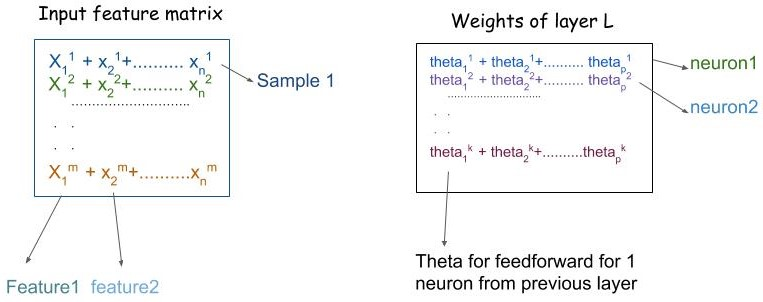
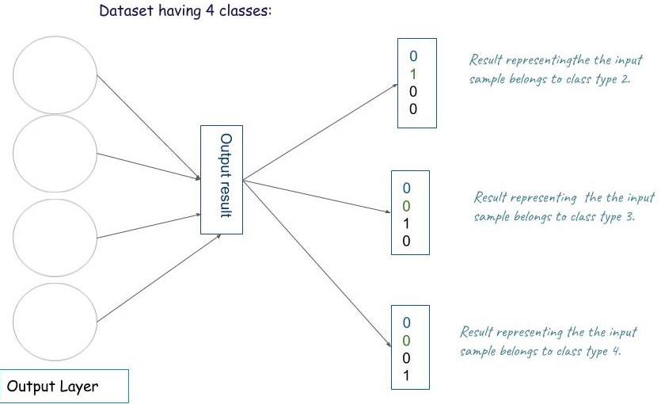

# MLP
****
## Overview
Multilayer perceptron is field of artificial neural networks ,which works in feedforward mechanism, Neural networks are simplified versions of the human brain
and consist of input, hidden and output layers . The objective of the neural network is to transform the
inputs into meaningful outputs. Multi-layer perceptron
(MLP) is the most common neural network model.
I have used the [sklearn wine](https://scikit-learn.org/stable/modules/generated/sklearn.datasets.load_wine.html#sklearn.datasets.load_wine) dataset for the model. 
_____
## Model
MLP model :

  

<strong>FIGURE 1:</strong> NN layer.

The neurons are arranged in different
layers, in each layer the nodes receive inputs only from the
nodes in the preceding layer and pass their outputs only to
the nodes of the next layer.  

1. Input layer consist of input features of a sample of dataset on which we will train our model.
2. Hidden layer consist of neurons in which weight function applies and then forward them to next layer after applying activation function.
3. Output Layer consist of neurons = number of classes that we have for one vs all model.

____
## Weights and shape

  

<strong>FIGURE 2:</strong> Input feature matrix and weight matrix.

The input feature matrix(X) consist of all sample points as shown above ,each column consist of feature: let we have n input feature, each row consist of a sample of dataset :let we have m samples. So input matrix would have shape m x n (Xmxn).

**Weights**:This is the basic component of NN where we intialized them ,transform the input to next layer and  get the results after applyting activation and update them as to minimize the error.

Our feed forward equation would be :
 for 1 neuron as we do in regression,where .
So 1 neurons would get input from all the neurons of previous layer and if we are having k neurons in layer L and lets say we have p neurons from previous layer ,thus all neurons from previous layer would feed forward their inputs, hence we would come up with the weight matrix for L with the shape k x p(Wk x p)  and similarly for bias weights (k x 1).

To avoid vanishing/exploding problem and the weights doesn't turn to be 0 or inf after few iterations,i initialize them with Yoshua Bengio weight initialization.
 
One can use the Xavier initialization also.

____
## Forward Propagation

Each neuron would have 2 component, feedforward(Z) and activation function(A) this together consist of forward propagation as shown in Figure 1. 

The size of W is k x p ,and input matrix is n x m, here p=n (p=previous layer nuron)  and b is also having size k x 1,so it would be broadcast to W*X,thus Z would come to be size of k x m.

For input layer X(mxn) so we would transpose it. 
Second component is activation function(A) , there are many types of activation function like : sigmoid,relu,tanh,softmax,leakyrelu. 

 
where is G activation function sigmoid/Relu/tanh..

Now will forward this activation value as input to next layer so general equation would be :

 
where <strong>l</strong> is current layer 

  

FIGURE 3: Output

Finally we would get the results from output layer after forward propagation from all layer ,let say we have 4 class classes in our dataset then in output layer would have shape (4 x 1) for one sample input, then for m samples we would get the output matrix of shape 4 x m.  For e.g [0 0 1 0],shows sample belongs to class 3. 
 We would use sigmoid for last layer and then by defining threshold(say 0.5) we can classify for each output of neuron to be 0 or 1. It might be the case that we can get more 1 in output as after sigmoid fucnction we get more values to be greater than 0.5 e.g.[0 1 1 1],then this is case of miss classification and then to get the more accurate result we need to update the weights such that this missclassification can be decrease.
 
**Note:** I have declare mapp function for the threshold ,one can go with it or can go without threshold value as the cost comes we can go with the highest value among all the values of outcome as we are implementing one-vs-all.  
____
## Backword Propagation
In order to update the weights we need to find the error ,which can be find using loss function , i am using log loss function .

 

As we need to minimize the error ,we need to update weights accordingly. We update the weights from output layer in backword direction, to get best weigths ,bias,Z and activation , we will take derivative of loss fuction wrt to W,b,Z,activation.
1. 
2. 

dA/dZ=derivative of activation function ,so for the output layer we can use dZ=A-Y when sigmoid is used in last layer 

3. 
4. 

so,finally we would have : 

for hidden layer:

dZ=A-Y, The shape of A and Y should be same if A=[class1 class2 class3 class4] ,then also Y=[class1 class2 class3 class4] ,in order to get series(all sample output class(Y))into this ,we'll use [one hot endcoding](https://pandas.pydata.org/pandas-docs/stable/reference/api/pandas.get_dummies.html). 

Uncomment the lines in [t_mlp.ipynb](t_mlp.ipynb) in training part to take input for number of hidden layer,number of neurons in each hidden layer, activation used for a particular layer. If one does not input any hidden layer the model would work as single layer perceptron.

